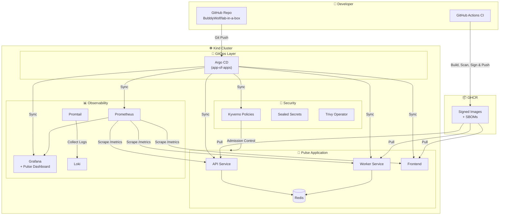
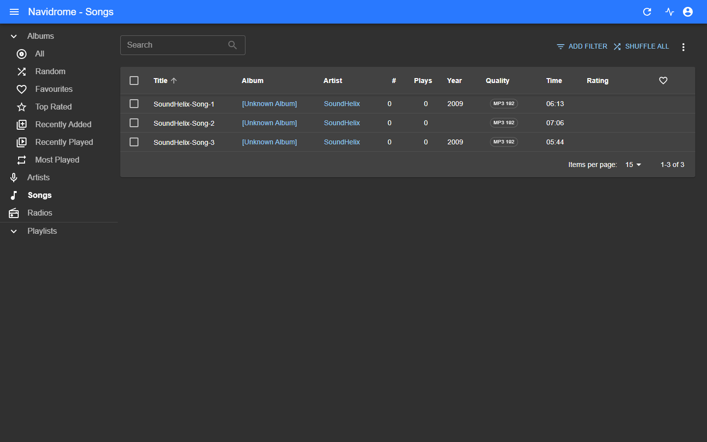

# 🧪 lab-in-a-box

> **Learn a real production Kubernetes platform by running one — on your laptop, offline, in 5 minutes.** No cloud account. No bill. No 40-tab tutorial.

[](https://opensource.org/licenses/MIT)
[](https://github.com/BubblyWolf/lab-in-a-box/actions)
[](https://kubernetes.io/)
[](https://helm.sh/)
[](https://argoproj.github.io/cd/)

---

## ⚡ TL;DR

- 💻 **Runs offline on your laptop** — [Kind](https://kind.sigs.k8s.io/) (Kubernetes-in-Docker). No cloud account, no credit card, no surprise bill.
- 🎓 **Built to learn from** — every piece is wired *and explained*. Start the cluster, then read the [guided walkthrough](docs/walkthrough.md) and watch each layer work.
- 🧱 **Real production patterns** — GitOps (app-of-apps), observability, admission-control security, signed images + SBOMs. Not toy YAML.
- ⚡ **Working demo app** — "Pulse" (3 Node.js microservices + Redis) with a live Grafana dashboard you can watch update.

```bash
make up            # Kind cluster + Argo CD + Monitoring + Security stack
make deploy-local  # Pulse app via Helm (no remote Git push needed)
make demo          # Port-forward all UIs: Argo CD, Grafana, Pulse frontend
```

> 🆚 **How this differs from other "platform-in-a-box" repos:** most assume a real cluster or cloud and hand you a wall of YAML. This one is **local-first, free, and teaches as it runs** — optimized for *understanding*, not just deploying. New to Kubernetes? This is your sandbox.

---

## 🎯 Why this exists

I wanted to learn how production platforms actually work — not just read about them, but *run* them. The cloud makes that expensive, and tutorials leave gaps between tools. So I wired everything together into a single, reproducible, local environment that goes from zero to GitOps in minutes. Now anyone can learn, break, and experiment with a real platform stack for free.

---

## 🏗️ Architecture



---

## 🚀 Quickstart

### Prerequisites

| Tool | Purpose | Check |
|------|---------|-------|
| [Docker](https://docs.docker.com/get-docker/) | Container runtime for Kind | `docker --version` |
| [kubectl](https://kubernetes.io/docs/tasks/tools/) | Kubernetes CLI | `kubectl version --client` |
| [kind](https://kind.sigs.k8s.io/docs/user/quick-start/#installation) | Local Kubernetes cluster | `kind version` |
| [helm](https://helm.sh/docs/intro/install/) | Kubernetes package manager | `helm version` |

### Steps

```bash
# 1. Clone
git clone https://github.com/BubblyWolf/lab-in-a-box.git
cd lab-in-a-box

# 2. Bootstrap everything (Kind cluster + Argo CD + platform)
make up

# 3. Deploy the Pulse demo app locally (no Git push required)
make deploy-local

# 4. Port-forward and open the UIs
make demo
```

| URL | What you'll see |
|-----|-----------------|
| https://localhost:8080 | **Argo CD** — watch apps sync live |
| http://localhost:3000  | **Grafana** — the custom "Pulse" dashboard |
| http://localhost:8081  | **Pulse frontend** — submit jobs, watch them process |

> **Two ways to run the app:**
> - `make deploy-local` installs the Pulse Helm chart directly — instant, no Git push needed.
> - **Full GitOps:** push this repo to your own fork and update `repoURL` in [`gitops/apps/pulse.yaml`](gitops/apps/pulse.yaml); Argo CD then syncs the app straight from Git.

---

## 🧩 What's inside

| Capability | Tool | Why it matters |
|------------|------|----------------|
| **GitOps** | Argo CD (app-of-apps pattern) | Git is the single source of truth; every change is auditable and self-healing |
| **Observability** | Prometheus + Grafana + Loki + a custom "Pulse" dashboard | Metrics and logs in one place, auto-scraped via pod annotations |
| **Security** | Kyverno + Sealed Secrets + Trivy Operator | Policy enforcement at admission, encrypted secrets in Git, image scanning |
| **CI/CD** | GitHub Actions (build, Trivy scan, SBOM, cosign sign) | Reproducible builds with supply-chain security artifacts |
| **Demo App** | Pulse — Node.js API + worker + frontend + Redis | Training-wheels app: built in-house so you can see every moving part |
| **Real App** | Navidrome — self-hosted music server | The "your own Spotify" you actually keep — deployed via Helm + GitOps, runs non-root to pass our security policies |

---

## 🎓 Learn & teach

This isn't just code to deploy — it's built to **learn from**, with everything explained in plain English (no Kubernetes background needed).

| If you're a... | Start here |
|----------------|-----------|
| 🌱 **Curious beginner** (any background) | [docs/concepts.md](docs/concepts.md) — every tool explained as a simple story |
| 🧑‍💻 **Student / hands-on learner** | [docs/walkthrough.md](docs/walkthrough.md) then the [labs](docs/labs/) — guided exercises that build real skill |
| 🧑‍🏫 **Teacher / workshop host** | [docs/course/](docs/course/) — a ready-to-teach 5-module curriculum with demo scripts and exercises |

> New to all this? The whole stack is explained with a **restaurant story** — if you can follow a recipe, you can follow this.

---

## 🔐 Security demo

Watch Kyverno block a non-compliant pod in real time:

```bash
kubectl apply -f security/examples/bad-pod.yaml

# Denied by admission control:
# Error from server: admission webhook "validate.kyverno.svc-fail" denied the request:
#   require-non-root:     'Pod must run as non-root.'
#   disallow-privileged:  'Privileged containers are not allowed.'
```

The bad pod runs **privileged and as root**, so two enforced policies reject it. The Pulse app pods pass cleanly (they already run non-root and unprivileged).

**Policies included** (`security/policies/`):

| Policy | Mode | Effect |
|--------|------|--------|
| `require-non-root` | Enforce | Blocks pods that don't run as non-root |
| `disallow-privileged` | Enforce | Blocks privileged containers |
| `require-resources` | Audit | Warns when CPU/memory requests are missing |
| `disallow-latest-tag` | Audit | Warns on `:latest` / untagged images |

System namespaces are excluded so the platform itself is never blocked.

---

## 📊 Observability

The **Pulse dashboard** is auto-loaded into Grafana (via the dashboards sidecar) and shows:

- **Job Rate** — `rate(pulse_jobs_submitted_total)` vs `rate(pulse_jobs_processed_total)`
- **Total Submitted** and **Total Processed** counters

Metrics are scraped automatically from any pod carrying the `prometheus.io/scrape` annotation — no Prometheus config edits needed. Logs from all pods flow to **Loki** via Promtail and are queryable in Grafana's Explore view.

---

## 🎵 Bonus: run your own music server

One command deploys [Navidrome](https://www.navidrome.org/) — a self-hosted, open-source music server ("your own Spotify"). Add your own music and stream it from anywhere.

```bash
make music          # deploys Navidrome → opens http://localhost:4533
```



It's deployed the same GitOps way as everything else, and configured to **run as non-root so it passes the Kyverno security policies** — a real lesson in deploying real apps securely. Because you supply your own music, it's completely legal to use and keep.

> 🧩 **Navidrome is just one example.** The same pattern runs almost any open-source app — Jellyfin (your own Netflix), Nextcloud (your own Drive), Gitea (your own GitHub), Uptime Kuma, and more. See **[docs/apps-you-can-run.md](docs/apps-you-can-run.md)** for a catalog and how to deploy any of them.

---

## 🗺️ Repo layout

```
lab-in-a-box/
├── Makefile                 # make up / down / status / demo / deploy-local / music / build-load
├── bootstrap/               # Kind cluster config, install.sh, build-images.sh
├── apps/demo/               # Pulse app source: api/ worker/ frontend/ (+ Dockerfiles)
├── charts/pulse/            # Helm chart that deploys Pulse + Redis
├── charts/navidrome/        # Helm chart for the Navidrome music server
├── gitops/                  # Argo CD manifests (root app + app-of-apps)
├── observability/           # Grafana dashboard ConfigMap
├── security/                # Kyverno policies, bad-pod example, docs
├── .github/workflows/       # CI (build/scan/sign) + Validate (lint/smoke)
└── docs/                    # concepts (stories) · walkthrough · labs · course · architecture · runbook
```

---

## 🤝 Contributing

Found a bug? Want to add a policy or exporter? See [CONTRIBUTING.md](CONTRIBUTING.md) for setup, the PR checks (helm lint, node smoke, kubeconform), and guidelines. All levels welcome — this is a learning project first.

---

## 📄 License

MIT © 2026 [Chitranjan Jegadeesan](https://github.com/BubblyWolf)

---

*Built to be learned from, forked, and improved. If this saves you a cloud bill or teaches you something, give it a ⭐ and tell me what you built.*
