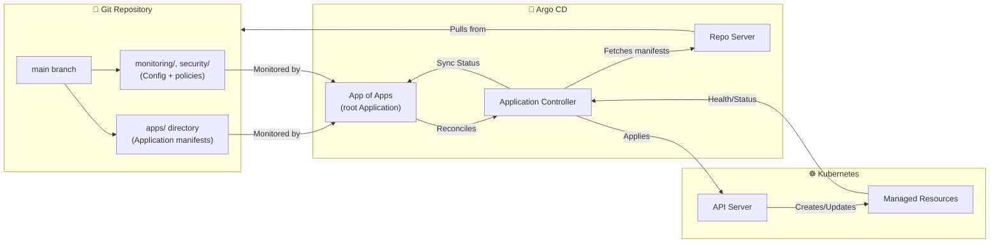
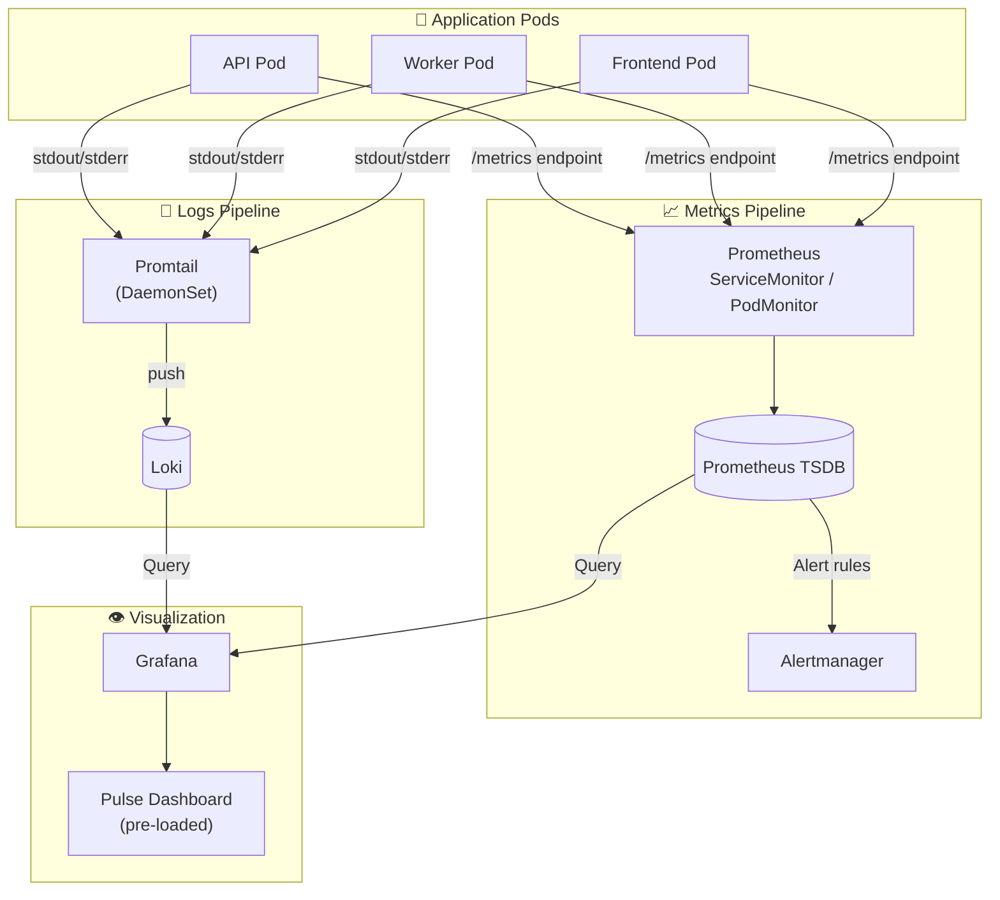
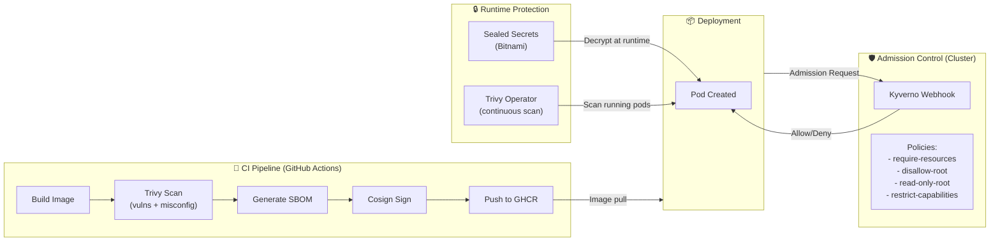

# Architecture Deep Dive

## System Overview

`lab-in-a-box` implements a complete platform engineering stack on a local Kind cluster, following production patterns used at scale: GitOps-driven deployment, pull-based observability, and defense-in-depth security.

---

## GitOps Flow: Git as Source of Truth

### How it works

1. **App of Apps pattern**: A root `Application` (in `apps/root.yaml`) watches the `apps/` directory and creates child Applications for each subsystem (pulse, monitoring, security).
2. **Argo CD's repo-server** polls Git (or receives webhooks) and renders manifests (plain YAML, Helm, or Kustomize).
3. **Application controller** compares desired state (Git) with live state (cluster) and applies differences.
4. **Self-healing**: Manual cluster changes are automatically reverted. Drift is impossible by design.

### GitOps benefits here

- **Full audit trail**: Every change is a Git commit with author, timestamp, and diff.
- **Easy rollbacks**: `git revert` + sync = instant rollback.
- **Environment parity**: Same manifests promoted from local → staging → production.

---

## Observability Data Flow

### Metrics: Prometheus via ServiceMonitor

Services expose `/metrics` using [Prometheus client libraries](https://prometheus.io/docs/instrumenting/clientlibs/). The `ServiceMonitor` CRD (from prometheus-operator) tells Prometheus which pods to scrape based on labels. This is the standard Kubernetes-native pattern — no static config files to edit.

Key metrics collected:
- HTTP request rate, latency, errors (RED method)
- Custom business metrics (jobs processed, queue depth)
- Node-exporter and cAdvisor for infrastructure

### Logs: Promtail → Loki

Promtail runs as a DaemonSet on every node, discovers pods via Kubernetes API, and pushes structured logs to Loki. Labels (pod name, namespace, trace ID) are extracted at ingestion for efficient querying.

**Why Loki, not Elasticsearch?** Loki is lightweight, index-free on log content, and Grafana-native. Perfect for local development and scales to production with object storage.

### The Pulse Dashboard

Built specifically for this stack, it answers: "Is my app healthy?" at a glance. Panels are organized by service with drill-down from metric spike → log correlation.

---

## Security Enforcement Points

### Layer 1: CI Pipeline (Prevent bad artifacts)

| Stage | Tool | Purpose |
|-------|------|---------|
| Build | Docker buildx | Reproducible, cached builds |
| Scan | Trivy | Block CVEs, misconfigurations in image |
| SBOM | Syft + Trivy | Generate SPDX/CycloneDX for supply chain |
| Sign | Cosign + Sigstore | Cryptographic image provenance |

### Layer 2: Admission Control (Prevent bad deployments)

Kyverno runs as a validating/mutating webhook. Every pod creation/update is checked against policies. Violations are rejected with clear error messages before resources reach the cluster.

Policies are in `security/policies/` and are versioned with Git.

### Layer 3: Runtime Protection (Protect running workloads)

- **Sealed Secrets**: Encrypt secrets for Git storage; only the cluster controller can decrypt.
- **Trivy Operator**: Continuously scans running images for newly disclosed CVEs.

---

## Design Decisions

### Why Kind?

| Alternative | Why not | Why Kind |
|-------------|---------|----------|
| minikube | Heavier, more VM-oriented | Docker-native, fast, CI-friendly |
| k3s/k3d | Great, but k3d adds complexity | Kind is the Kubernetes SIG-tested reference |
| Cloud (EKS/GKE) | Costs money, network latency, setup time | Zero cost, offline-capable, instant reset |

Kind runs a multi-node cluster in Docker containers. It's the standard for Kubernetes development and testing. `make up` creates a 3-node cluster (1 control plane, 2 workers) with port mappings for all UIs.

### Why App-of-Apps?

Managing 10+ Argo CD Applications individually is tedious. The app-of-apps pattern lets a single root Application generate all others. One sync deploys everything; one delete removes everything cleanly.

### Why Report-Only Trivy in CI?

The CI pipeline runs `trivy image` with `--severity HIGH,CRITICAL` but **does not fail the build** by default (configurable via `TRIVY_EXIT_CODE`). This is intentional for a learning project:

- **Report-only**: You see vulnerabilities without broken builds blocking experimentation
- **Shift-left**: Awareness without friction; fix at your pace
- **Production hardening**: Set `TRIVY_EXIT_CODE=1` and `trivy-operator` in enforce mode for real deployments

The pipeline still generates SBOMs and signs images — those are hard requirements regardless of scan results.

---

## Data Flow Summary

| Path | Source | Destination | Mechanism |
|------|--------|-------------|-----------|
| Desired state | Git repo | Cluster | Argo CD poll + apply |
| Metrics | App pods | Grafana | Prometheus scrape + PromQL |
| Logs | App pods | Grafana | Promtail push + LogQL |
| Secrets | Developer `kubeseal` | Cluster | Sealed Secrets controller decrypt |
| Images | CI pipeline | GHCR | Docker push + cosign sign |
